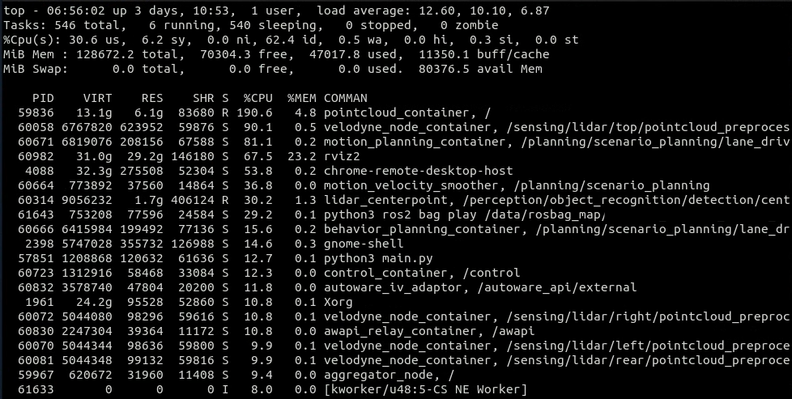
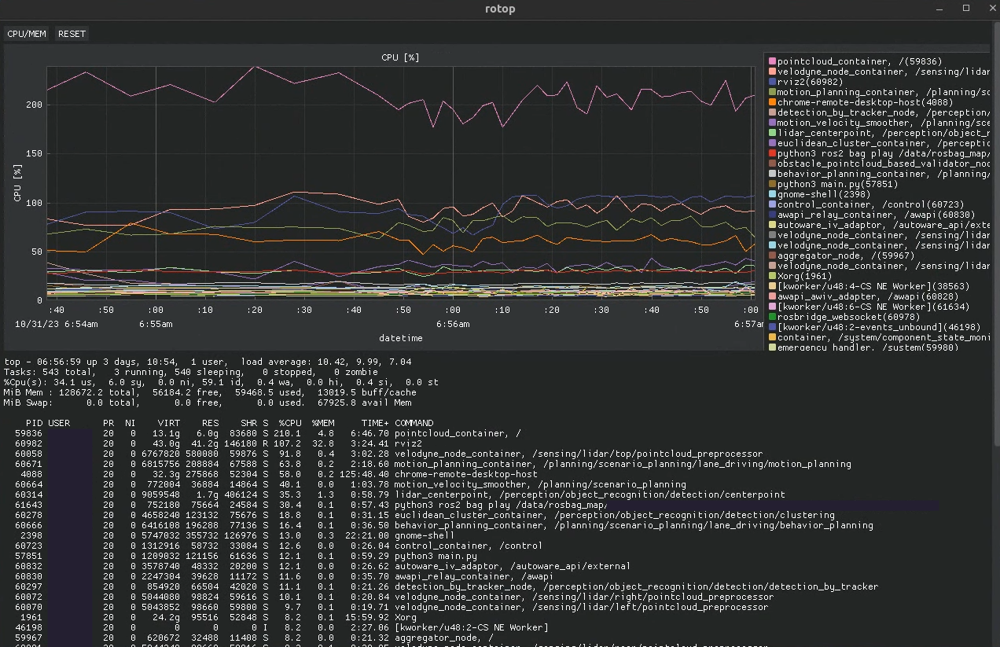

# rotop

## About

top command for ROS 2

## Features

- Replace a long displayed name for ROS 2 command and Python command, especially for component container
  - :sob: Normal `top` command : "`component_container`"
  - :sob: Normal `top -c` or `htop` : "`/very/long/path/component_container` `very-long-options`"
  - :smile: My `rotop` command: "`{node_name}, {name_space}`"
- Filter function
- csv file logger
- Graph plotter

## How to use

```sh
pip3 install rotop

rotop
rotop --gui


# usage: rotop [-h] [--interval INTERVAL] [--filter FILTER] [--csv] [--gui] [--num_process NUM_PROCESS]
# options:
#   -h, --help            show this help message and exit
#   --interval INTERVAL
#   --filter FILTER
#   --csv
#   --gui
#   --num_process NUM_PROCESS
```

```sh
cd rotop
python3 main.py
```

## Screen Shot

- CUI mode
  - 
- GUI mode
  - 
